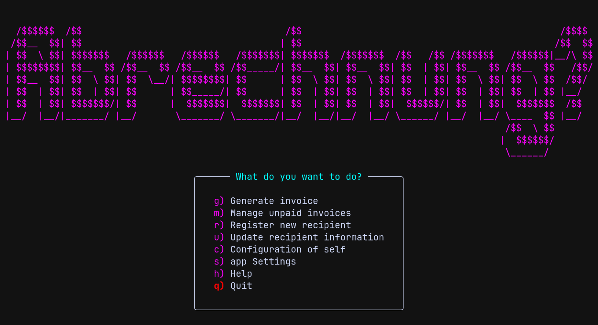

# Abrechnung - Invoice Generator

A Kotlin-based TUI application for generating invoices and sending them to customers.
Designed for freelancers and small businesses, with a retro aesthetic.



## Features

- **Efficiency** - The fat has been trimmed away, leaving a minimal amount of impediments between you and a shipped invoice. Fill in the (tiny) form, hit yes, and you're done.
- **Personality** - Abrechnung has interactive theme music composed by Bernelius and an interface that feels powerful and uncompromising.
- **Invoice Generation** - Create PDF invoices that look like [this](./screenshots/abrechnung_invoice_example.png)
- **Recipient Management** - Register and update customer information
- **Invoice Management** - Track and manage unpaid invoices
- **Email Integration** - Send invoices directly via email
- **Multi-language Support** - [Output in any language, customizable](#language-structure)
- **Theme Customization** - [Customizable color themes](#themes)

## Tech Stack

- **Kotlin** - Programming language
- **Gradle** - Build system
- **Mordant** - Terminal UI framework
- **Exposed** - SQL framework
- **OpenPDF** - PDF generation
- **Jakarta Mail** - Email sending
- **LWJGL/OpenAL** - Audio playback

## Requirements

### If you download an executable from the [releases page](https://github.com/bernelius/abrechnung/releases)

- Windows 10/11: You need to have Windows Terminal installed. This comes pre-installed with Windows 11, but might need to be installed separately for Windows 10.
- Linux: Any terminal emulator
- MacOS: Any terminal emulator
- See [Running](#running) for instructions on how to run the program.

### If you clone the repository

- A terminal emulator
- Java 24+
- [Just](https://github.com/casey/just) (optional, but this readme's examples use it.)
- See [Building](#building) and [Running](#running) for instructions.

## Configuration

On first run, the application prompts for the essential information needed to create an invoice:

- Your name/company details
- [Optional] Email config, if you want the invoices to be automatically sent upon creation  
  It stores these values along with customer data in a local database by default.  
  See the [Database](#database-options) section for information on how to use another database.

The app looks for your XDG_CONFIG_HOME directory, and falls back to `~/.config/` if not found.  
It will create an abrechnung subdirectory inside this config directory.

See the [Security](#security) section for information on how to set up encryption at rest.

## Configuration Options

Stored in `$XDG_CONFIG_HOME/abrechnung/config.toml`

### Terminal Config

```toml
[terminalConfig]
# Theme name (see available themes below)
theme = "retro-glitch"

# Enable outer hotkeys (UI preference)
outerHotkeys = true
```

### Invoice Config

```toml
[invoiceConfig]
# Days until payment is due (default: 14)
dueDateOffset = 14

# Default VAT rate in percent
vatRate = 0

# Currency code (default: NOK)
currency = "NOK"

# Language for invoice output (see Languages below)
language = "en"
```

## Themes

Abrechnung ships with 8 built-in themes:

| Theme                    | Description                   |
| ------------------------ | ----------------------------- |
| `retro-glitch`           | Magenta/cyan/yellow cyberpunk |
| `blood-moon`             | Dark red monochrome           |
| `catppuccin-mocha-rouge` | Pastel pink/purple/teal       |
| `deep-forest`            | Green natural palette         |
| `neon`                   | Bright neon colors            |
| `frozen-wasteland`       | Ice blue monochrome           |
| `toxic-sludge`           | Yellow/green/brown industrial |
| `solar-flare`            | Bright orange/pink/yellow     |

### Theme Structure

Themes are stored in `$XDG_CONFIG_HOME/abrechnung/themes/` as TOML files:

```toml
name = "retro-glitch"
primary = "#ff00ff"    # Main accent color
secondary = "#00ffff"  # Secondary accent
tertiary = "#ffff00"   # Tertiary accent
success = "#00ff00"    # Success messages
error = "#ff0000"      # Error messages
warning = "#ff8800"    # Warning messages
info = "#0000ff"       # Info messages
```

### Creating Custom Themes

1. Copy an existing theme file from `~/.config/abrechnung/themes/`
2. Rename and modify the colors
3. Select it in in the app settings menu from the main menu (inside the app)

## Languages

Two built-in languages:

| Code | Description |
| ---- | ----------- |
| `en` | English     |
| `no` | Norwegian   |

### Language Structure

Languages are stored in `~/.config/abrechnung/languages/` as TOML files.  
On Windows, the config directory is located at `C:\Users\<username>\.config\abrechnung\languages\`

The fields are used for the output invoice pdf.

```toml
name = "en"
headline = "INVOICE"
orgNumber = "Org. number"
billTo = "Bill to"
invoiceNumber = "Invoice Number"
invoiceDate = "Invoice Date"
datePattern = "dd.MM.yyyy"
dueDate = "Due Date"
description = "Description"
quantity = "Qty"
discount = "Discount"
price = "Price"
subtotal = "Subtotal"
total = "Total"
amount = "Amount"
toBankAccount = "To bank account"
vat = "VAT"
paymentInformation = "Payment Information"
paymentNote = "Please include the..."
```

### Creating Custom Languages

1. Duplicate `en.toml` from `~/.config/abrechnung/languages/` and rename it, e.g. `fi.toml` for Finnish
2. Translate strings
3. Set `language` in `invoiceConfig.toml` to `fi` instead of `en`

## Security

### Encryption at Rest

Abrechnung encrypts sensitive data using **AES-256-GCM**. The following fields are encrypted:

- Your bank account number
- Your email password

### Required Environment Variables

You must set these environment variables for encryption to be secure.
Once set, the app must be launched with the environment variables set every time it is run.
If you opt to use the default values and later wish to change them, the previously encrypted data will be unreadable.
You can update the values in the "Configuration of self" menu inside the app if this is the case.

| Variable          | Description                                     |
| ----------------- | ----------------------------------------------- |
| `ABRECHNUNG_KEY`  | Encryption key password (minimum 16 characters) |
| `ABRECHNUNG_SALT` | Salt for key derivation (any string)            |

**Example:**

```bash
export ABRECHNUNG_KEY="your-secure-random-password-here"
export ABRECHNUNG_SALT="unique-string-whatever-you-want"
just run
```

### What Happens If You Don't Set the Key?

The app will use fallback defaults (`NotSecretKey0000` / `DefaultOpenSourceSalt`), which provides no real security.  
**If you care about a potential attacker having plain text access to your bank account number (no biggie?) and email password (potential biggie), set custom values**  
To be fair, the output folder also contains the finished pdf files, where your bank account number is obviously visible in plain text.

## Data Locations

### Database

The default database is a local SQLite file, stored in a platform-specific data directory:

| Operating System | Default Database Location                                |
| ---------------- | -------------------------------------------------------- |
| **Windows**      | `%APPDATA%\Abrechnung\data\abrechnung.db`                |
| **Linux**        | `~/.local/share/abrechnung/abrechnung.db`                |
| **MacOS**        | `~/Library/Application Support/Abrechnung/abrechnung.db` |

You can override the data directory by setting the `ABRECHNUNG_DATA_DIR` environment variable.  
It is possible to supply your own database connection url if you want to use postgres instead.  
Set the `ABRECHNUNG_DB_URL` environment variable to your [jdbc formatted](https://jdbc.postgresql.org/documentation/use/) connection url, and off you go.  
Note that you need to include the db username and password in this url.  
There is an in-memory TTL cache (5 mins) and async requests wherever I found it sensible, so using an external database should introduce minimal friction even with high latency connections.

### Invoice Output

Generated PDF invoices are saved to a platform-specific documents directory:

| Operating System | Default Output Location                                          |
| ---------------- | ---------------------------------------------------------------- |
| **Windows**      | `<localized Documents folder>\Abrechnung\` (e.g., `Documents`, `Dokumente`, `Dokumenter`) |
| **Linux**        | `<xdg-user-dir DOCUMENTS>/Abrechnung/` (uses XDG user directories, falls back to `~/Documents/Abrechnung/`) |
| **MacOS**        | `~/Documents/Abrechnung/`                                        |

On Windows, the app automatically detects the localized name of your Documents folder (e.g., "Dokumente" on German Windows, "Dokumenter" on Norwegian Windows).  
On Linux, the app uses the `xdg-user-dir` command to get the localized Documents path, falling back to `~/Documents/Abrechnung/` if not available.  
You can override the output directory by setting the `ABRECHNUNG_OUTPUT_DIR` environment variable.

## Building

#### Build shadowJar

```bash
just build
```

#### Build native executable

```bash
just build-native
```

## Running

### If you downloaded one of the releases

- On Windows: Use the downloaded installer and run the shortcut from your start menu or desktop.
- On Linux: Run the executable from the terminal.
- On MacOS: Run the executable from the terminal.

### If you cloned the repository

#### Run shadowJar (after building it)

```bash
just run
```

#### Run native executable (after building it)

```bash
just run-native
```

See the [justfile](./justfile) for more commands.

### License

MIT
